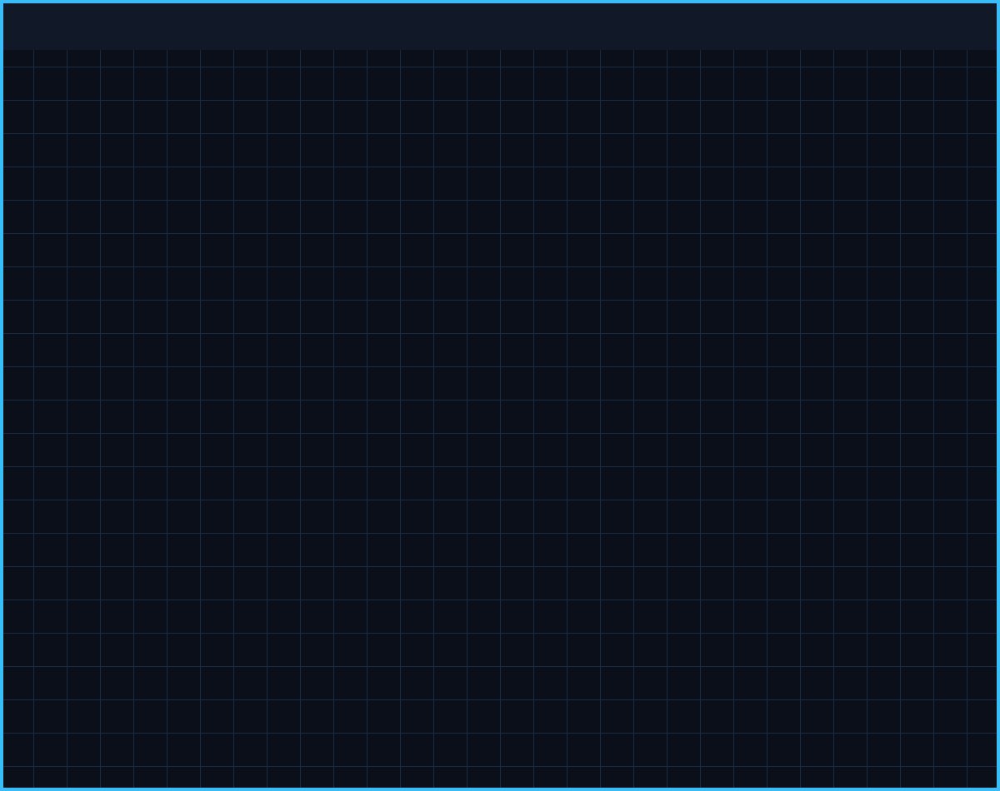
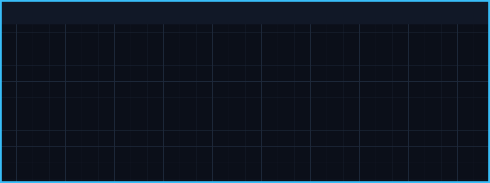

# MUDI UNDO?™ (മുടി ഉണ്ടോ?) 🎯

## Basic Details
**Team Name:** MuttaPuffs  
**Team Members:**  
* **Team Lead:** Joe Martin Rince  
* **Member 2:** Alex Roy  

---

## Project Description
MUDI UNDO?™ (*Malayalam for "Is there hair?"*) is an unverified, state-of-the-art computer vision platform designed to audit, classify, and certify human hair coverage in real-time. By combining browser camera acquisition with Gemini Vision AI, MUDI UNDO?™ estimates hair population down to the individual follicle, assigns official ecological woodland classifications (from *Moon Surface* to *Dense Forest*), and pairs users with their deterministic fictional **Census Twin** (from Saitama to Super Saiyan Goku).

---

## The Problem (that doesn't exist)
In an era of rampant follicular uncertainty, millions of individuals wake up every morning asking themselves: *"Do I actually have hair, or is my forehead staging a hostile takeover of my scalp?"* Traditional government census bureaus track population, housing, and income—yet completely ignore the national hair reserve. Without official government-grade hair telemetry, citizens are left vulnerable to barber disputes, existential hairline dread, and uncertified baldness claims.

---

## The Solution (that nobody asked for)
Introducing **MUDI UNDO?™**—the world’s first National Hair Census Bureau application. Users position their head inside a technical position frame, capture a selfie, and transmit it to Gemini 2.5 Flash Vision AI. In seconds, our platform runs a transparent population estimation formula, determines scalp exposure vs. hair coverage, issues an official printable Hair Census Certificate (DOC MU-11), matches the user with a legendary pop-culture **Census Twin** (featuring Gojo Satoru, Kakashi, Walter White, Saitama, and more with exact compatibility scores), and provides an official Dispute Portal for aggrieved citizens who refuse to accept reality.

---

## Technical Details

### Technologies/Components Used

#### For Software:
* **Languages:** TypeScript, JavaScript, HTML5, CSS3
* **Frameworks:** React 19, TanStack Start, TanStack Router, Vite 8, Nitro Server Engine (Cloudflare Module Preset)
* **Libraries:** Google Gen AI SDK (`@google/genai`), Lucide React Icons, Tailwind Merge, Class Variance Authority
* **Tools:** Git, GitHub, PowerShell, Node.js, `npx tsx`

#### For Hardware:
* **Camera Input:** Smartphone / PC Front-facing Selfie Camera via HTML5 `MediaDevices.getUserMedia()`
* **Processing Hardware:** Any modern Chromium/WebKit/Gecko web browser on mobile or desktop

---

## Implementation

### For Software:

#### Installation
```bash
# Clone the repository
git clone https://github.com/JoeMartinRince/MUDI_UNDO.git
cd MUDI_UNDO

# Install dependencies
npm install
```

#### Environment Setup
Create a `.env` file in the project root and add your Gemini API key:
```env
GEMINI_API_KEY="your_gemini_api_key_here"
```

#### Run
```bash
# Start local development server
npm run dev

# Open http://localhost:3000 in your browser
```

#### Build
```bash
# Compile TypeScript and bundle production assets
npx vite build
```

---

## Project Documentation

### For Software:

#### Screenshots

  
*Live camera acquisition screen featuring front-facing selfie preference, real-time head placement overlay, and capture controls.*

  
*Official Hair Census Report displaying estimated hair population count, hair coverage %, scalp exposure %, and woodland ecological classification.*

  
*Data-driven Census Twin result card showing high-contrast character avatar, match percentage score, density compatibility bar, and character description.*

#### Diagrams

  
*End-to-end technical pipeline flow: Browser Camera Capture ➔ Base64 Preparation ➔ Gemini Vision AI Analysis ➔ Population Estimator ➔ Deterministic Census Twin Matcher ➔ Certificate Generation.*

---

## Project Demo

### Video
[MUDI UNDO?™ Official Demo Video](https://github.com/JoeMartinRince/MUDI_UNDO)  
*Demonstrates live camera acquisition, Gemini Vision analysis, real-time telemetry processing, Census Twin matching, and the interactive Dispute Portal.*

### Additional Demos
* [GitHub Repository — JoeMartinRince/MUDI_UNDO](https://github.com/JoeMartinRince/MUDI_UNDO)
* [Localhost Web App](http://localhost:3000)

---

## Team Contributions
* **Joe Martin Rince:** Full Stack Development — Gemini 2.5 Flash Vision AI integration, Server Functions, Census Twin Matcher algorithm, Camera acquisition pipeline, repository management.
* **Alex Roy:** Full Stack Development — UI/UX design system, TanStack Start & Router architecture, Census Twin character dataset, Certificate generation, Dispute Portal modal, production build optimization.
